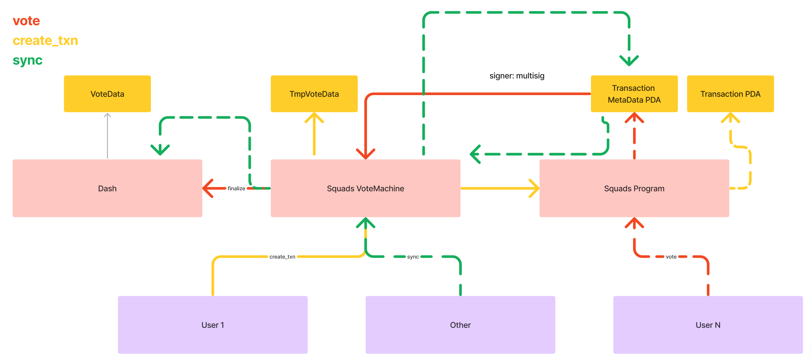

# Solana Workflow @ DASH

## Description

This is the test version of DASH. Functions:

- create: create a workflow_pda and a list of checkpoint_pda.
- new: create a mission from the starting point of the workflow
  - create mission_pda
  - copy head checkpoint_pda and change its content
- vote: make a choice on a mission
  - create new new pda
  - change current checkpoint of misison_pda to the newly created one

### Squads

Action:
- Create transaction: Off-chain
- Vote: On-chain
- Finalize/Execute: On-chain